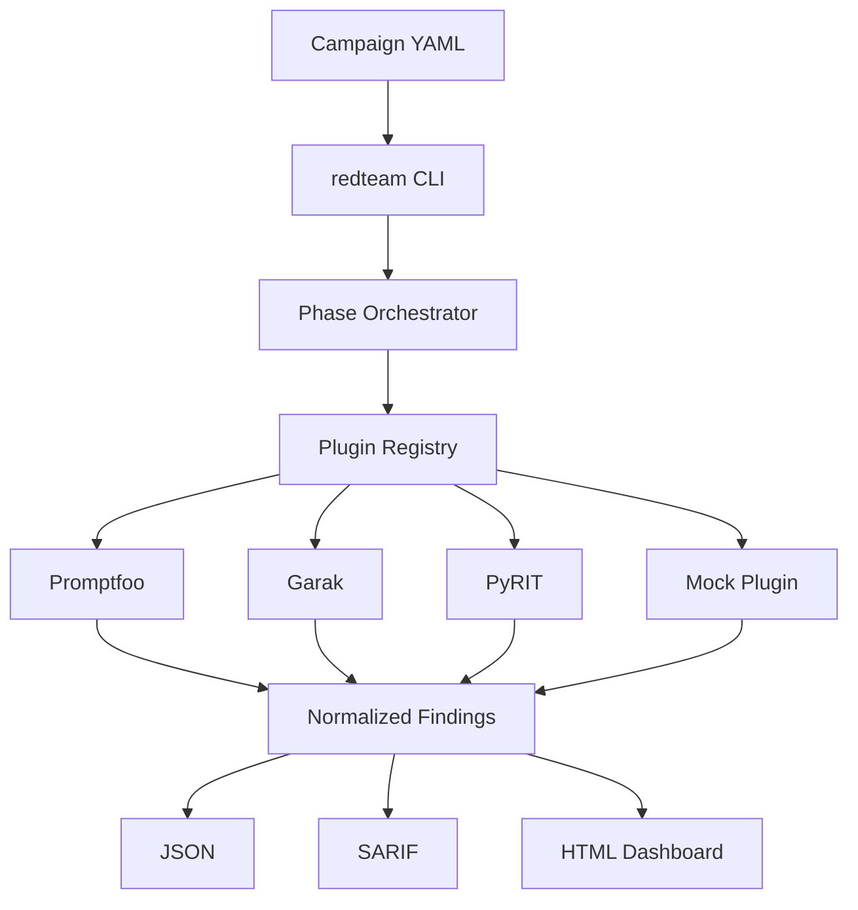
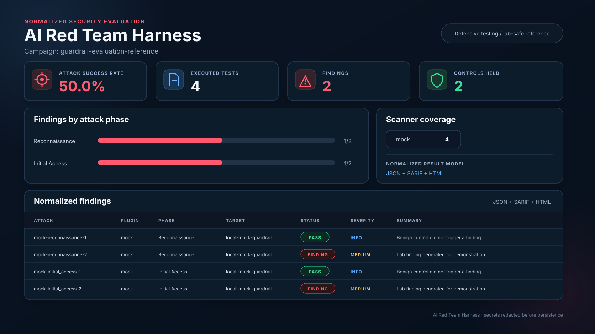

# AI Red Team Harness

A modular orchestration framework for **repeatable AI guardrail and LLM security testing** across multiple attack engines, targets, and environments.

The project demonstrates a production-minded security architecture around Promptfoo, Garak and PyRIT-style workflows without publishing organization-specific prompts, credentials, endpoints, or findings.

> Designed for authorized defensive testing and security research.


## Why this exists

AI security teams often end up with several excellent scanners that produce different formats, require different target adapters, and are difficult to run consistently across development, staging and production-like environments. This harness provides the orchestration layer around them:

- one campaign definition
- one CLI
- phase-based execution
- pluggable scanner adapters
- normalized results
- HTML, JSON and SARIF reporting
- local Docker workflow
- AWS Fargate reference deployment
- security controls around scanner execution and target selection

## Architecture



## Security-first design

This repository intentionally adds controls around the red-team tooling itself:

- **No `shell=True`**: external tools execute as explicit argv lists.
- **Executable allow-listing**: a Promptfoo adapter must invoke `promptfoo`, Garak must invoke `garak`, etc.
- **Target validation**: link-local, metadata, multicast and reserved destinations are blocked, with private/loopback targets denied by default.
- **Two-part private-network opt-in**: lab/VPC targets require both `allow_private_networks: true` in the campaign and operator-controlled `REDTEAM_ALLOW_PRIVATE_NETWORKS=1` at runtime.
- **Redirect denial**: HTTP redirects are disabled for target requests to prevent a validated endpoint from pivoting the harness into another trust zone.
- **Secret discipline**: sensitive environment variables are not expanded into campaign data, runtime secrets belong in explicit adapter/plugin environment allow-lists or a cloud secret store.
- **Scanner environment isolation**: external tools receive a minimal environment plus only explicitly requested variables, reducing accidental credential exposure.
- **Output redaction**: nested scanner output, evidence, summaries and report data are recursively redacted before persistence.
- **Bounded execution**: plugin timeout and output-size limits reduce runaway scans and denial-of-wallet style failure modes.
- **Path confinement**: reports cannot escape the configured results directory.
- **Cloud least privilege**: Terraform defaults scanner egress to deny, enforces TLS for S3, uses separate ECS execution/task roles and never manages secret values in state.

## Attack phases

| Phase | Example focus | Typical engines |
|---|---|---|
| Reconnaissance | model fingerprinting, capability discovery | Garak |
| Initial Access | direct/indirect prompt injection, jailbreaks | Promptfoo, Garak |
| Privilege Escalation | advanced bypass and instruction-boundary attacks | Garak, PyRIT |
| Persistence | context poisoning, memory manipulation | PyRIT |
| Exfiltration | sensitive-data extraction, training-data probes | Garak, PyRIT |
| Impact | resource abuse, unsafe output, guardrail failure | Garak |
| Benchmark | repeatable regression suites and release gates | Promptfoo |

## Quick start

```bash
python -m venv .venv
source .venv/bin/activate       # Windows: .venv\\Scripts\\activate
pip install -e .[dev]

redteam validate config/campaign.example.yaml
REDTEAM_ALLOW_PRIVATE_NETWORKS=1 redteam run config/campaign.example.yaml --output-dir results
```

The included campaign uses the built-in safe mock plugin, so the orchestration and reporting pipeline works without installing an external scanner.

### Run the local mock target

```bash
python -m redteam_harness.demo.mock_guardrail
```

Or:

```bash
docker compose -f docker/docker-compose.yml up --build
```

## CLI

```bash
redteam run config/campaign.example.yaml --phase initial_access
redteam run config/campaign.example.yaml --target development
redteam benchmark config/campaign.example.yaml --target development --target staging
redteam list-plugins
redteam list-plugins --phase initial_access
redteam validate config/campaign.example.yaml
redteam generate-config -o campaign.yaml
```

## External scanner adapters

Promptfoo, Garak and PyRIT are intentionally **optional**. The harness does not bundle every scanner into a single oversized privileged image. Each adapter accepts an explicit argv list and executes only the expected tool binary.

Example Promptfoo phase:

```yaml
- name: promptfoo-regression
  phase: benchmark
  plugin: promptfoo
  target: development
  plugin_config:
    command:
      - promptfoo
      - eval
      - -c
      - config/promptfoo/regression.yaml
      - -o
      - "{output}"
    timeout_seconds: 600
```

See [`docs/TOOLS.md`](docs/TOOLS.md) and [`docs/PLUGIN-DEVELOPMENT.md`](docs/PLUGIN-DEVELOPMENT.md).

## Reporting

<p align="center">
  
</p>

Every run produces:

- `results.json` for automation and analysis
- `results.sarif` for security tooling and code-scanning pipelines
- `report.html` for human review

The normalized model makes it possible to compare different scanners and targets without coupling downstream reporting to a single tool's native output format.

## AWS reference deployment

The Terraform example provisions:

- ECR with immutable tags and image scanning
- ECS Fargate task definition
- CloudWatch logging and Container Insights
- encrypted, private S3 results storage
- separate execution and task IAM roles
- egress-only task security group
- runtime Secrets Manager references without storing secret values in Terraform

```bash
cd deploy/terraform
terraform init
terraform plan \
  -var='vpc_id=vpc-xxxxxxxx' \
  -var='private_subnet_ids=["subnet-aaaa","subnet-bbbb"]' \
  -var='allowed_egress_cidrs=["203.0.113.0/24"]'
```

The example is intentionally incomplete for production networking. HTTPS egress is denied unless `allowed_egress_cidrs` is supplied. Deploy it into private subnets with only the destination ranges, NAT path, or VPC endpoints required for the authorized assessment target.

## CI and supply-chain security

GitHub Actions runs:

- Ruff
- MyPy
- pytest with coverage
- Bandit
- pip-audit
- Trivy filesystem/IaC scanning
- SARIF upload to GitHub code scanning

The container uses a multi-stage build and runs as a non-root user with a read-only root filesystem in the reference ECS definition.

## Repository layout

```text
redteam_harness/      Python package, CLI, target adapters, orchestration and plugins
config/               Example campaigns and scanner configuration
docker/               Hardened local/container workflow
deploy/terraform/     AWS Fargate reference infrastructure
docs/                 Architecture, threat model and plugin guidance
tests/                Unit and end-to-end orchestration tests
.github/workflows/    CI and security scanning
```
